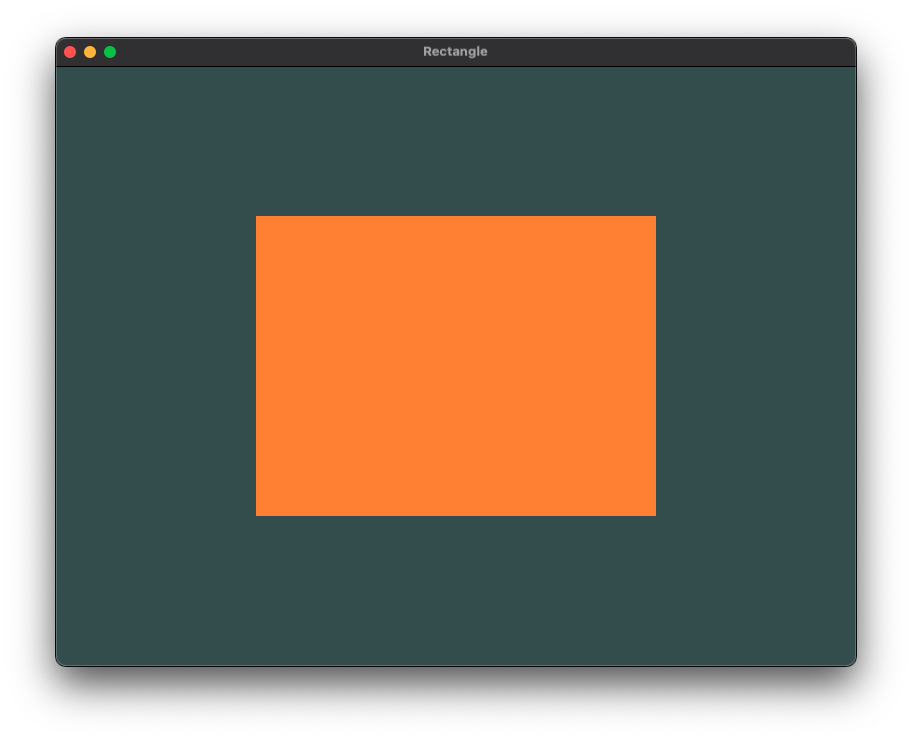
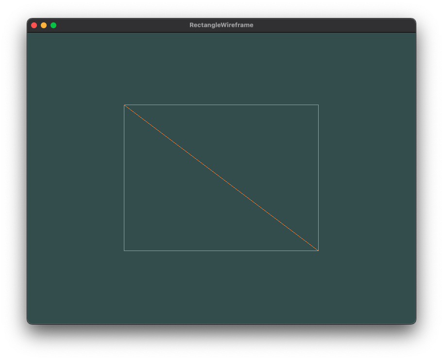

# Rectangle

# Rectangle drawn in **wireframe mode**
The wireframe rectangle shows that the **rectangle** indeed consists of **two triangles**.
- To draw your triangles in wireframe mode, you can configure how OpenGL draws its primitives via `glPolygonMode(GL_FRONT_AND_BACK, GL_LINE)`
    - The first argument says we want to apply it to the front and back of all triangles;
    - The second line tells us to draw them as lines. 
Any subsequent drawing calls will render the triangles in wireframe mode until we set it back to its default using `glPolygonMode(GL_FRONT_AND_BACK, GL_FILL)`.

